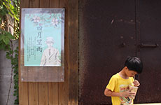

#第06課 內容的區塊


## (3) 小區域加圖片(背景)


#####執行結果:


#####檔案放置方式:
```
   | 
   |___<css>
   |     |___ main.css
   |
   |___<images>
   |     |___ item01.jpg   (230像素*150像素)
   |     |
   |     |___ item02.jpg   (230像素*150像素)
   |     |
   |     |___ item03.jpg   (230像素*150像素)	 
   |
   |___index.html   
```


#####檔案名稱: index.html 
```html
<!doctype html>
<html>
<head>
<meta charset="utf-8">
<title>測試網頁</title>
<!-- 加入 main.css -->
<link href="css/main.css" rel="stylesheet" type="text/css" />
</head>
<body>
    <!-- *** 加入一個容器區塊 *** -->
    <div class="container">

        <div class="header">
            過得像個人，才能看到美
        </div>

        <div class="content">            
            <div class="item">
                
                <h3>真正的美，作假不得 </h3>
                <p>我原來希望的藝術是能恢復人的品味和人的感覺，但他們接觸了這些東西卻沒有感覺，像有些企業會固定舉辦一些音樂會，但他們卻沒有辦法進入那個世界。所以我現在希望向大家說的是「人的原點」，當我們失去了人的原點，談所有...</p>
            </div>

            <div class="item">
                
                <h3>找回人與人之間的感覺 </h3>
                <p>我現在不問工程師有沒有去聽音樂、看展覽，反而是問他們：「你們在這裡工作5年了，有沒有人可以告訴我公司門口那一排是什麼樹？」但很少人能夠回答的出來。事實上，他們公司門口那排小葉欖仁的葉子漂亮得不得了，綠色... </p>
            </div>

            <div class="item">
                
                <h3>週休二日，回來做自己 </h3>

                <p>現在台灣過週休二日，好像非要全家去吃一個餐廳、到哪裡去看薰衣草、喝咖啡，全部整套，然後全部的人塞車塞到一肚子氣。我們對休閒的定義是滿僵化的，好像一定要別人服務我們才算是休閒。我自己假日的時候喜歡自己...</p>
            </div>

            <div class="clear"></div>    
        </div>

        <div class="footer">
            NTUB imd, 2017.    
        </div>        
    </div>
</body>
</html>
```


#####檔案名稱: css/main.css
```css
@charset "utf-8";

/*---------------------------*/
/* 引用思源中文                */
/*---------------------------*/
@import url(http://fonts.googleapis.com/earlyaccess/notosanstc.css);


/*---------------------------*/
/* 定義網頁                   */
/*---------------------------*/
html, body{
    font-size:17px;
    /*設定思源中文*/
    font-family: 'Noto Sans TC', sans-serif;
    font-weight: 280;   
    background:#444;    
}


div.clear{
    clear:both;
}


/*---------------------------*/
/* 定義容器                   */
/*---------------------------*/
div.container{
    width:800px;
    border:1px solid #666;  
    margin:10px auto 10px auto;   
    background:#fff;
    box-shadow:0px 0px 10px 0px #000;
}


/*---------------------------*/
/* 定義標題                   */
/*---------------------------*/
div.header{
    height:150px;
    background:#CCC;
    font-size:40px;
    text-align:center;
    line-height:150px;
    letter-spacing:7px;
}


/*---------------------------*/
/* 定義內容                   */
/*---------------------------*/
div.content{       
    padding:0px 25px 20px 25px;
}


div.content div.item{       
    width:230px;
    height:470px;	
    box-sizing:border-box;  	  
    float:left; 
    overflow:hidden;    
    border:1px solid #000;       
    box-shadow:0px 0px 2px 0px #000;    
    text-align:justify;
    margin-top:25px;
    margin-right:30px;
}


div.content div.item h3,
div.content div.item p{
    padding-left:12px;
    padding-right:12px;
}


/* 每3個中的第3個元素 */
div.content div.item:nth-child(3n+3){
    margin-right:0px;
}


/*---------------------------*/
/* 定義表尾                   */
/*---------------------------*/
div.footer{
    height:100px;
    line-height:100px;
    background:#CCC;
    font-size:13px;
    text-align:center;
    letter-spacing:3px;
}
```
