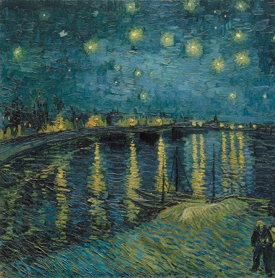
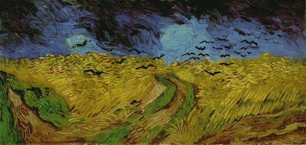
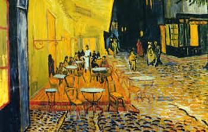

# 第12課-(2) Chart.js圖表

##### 執行結果:


##### 檔案放置方式:
```
   |
   |___<images>
   |     |___ logo.jpg (80*80)
   |     |___ 1.jpg    (230*230)
   |     |___ 2.jpg    (230*230)
   |     |___ 3.jpg    (230*230)
   |       
   |___<css>
   |     |___ main.css
   |     
   |___<js>
   |     |___ Chart.bundle.js
   |     |___ my.Chart.bundle.js
   |     |___ jQueryRotate.js
   |     |___ scripts.js   
   |
   |___index.html   
```

### (1) 圖片檔
```
在<下載>資料夾中, 下載images.zip.
```


### (2) 檔案名稱: main.css
```css
@charset "utf-8";

/*---------------------------*/
/* 引用思源中文                */
/*---------------------------*/
@import url(http://fonts.googleapis.com/earlyaccess/notosanstc.css);


/*---------------------------*/
/* 定義網頁                   */
/*---------------------------*/
html, body{
    font-size:17px;
    /*設定思源中文*/
    font-family: 'Noto Sans TC', sans-serif;
    font-weight: 400;	
    background-color:#12150a;
    margin:0;	
}


/*---------------------------*/
/* 定義標題                   */
/*---------------------------*/
div.header{
    width:100%;	
    min-width:800px;
    height:80px;
    background:#2d3854;    
    position:fixed;
    z-index:20;
    box-shadow:0px 1px 3px 1px #000;
}


/*---------------------------*/
/* 定義logo圖示               */
/*---------------------------*/
div.header img.logo{
    width:80px;
    height:80px;
    border-radius:40px;
    position:absolute;
    z-index:100;
    left:50%;
    top:20px;
    margin-left:-40px;
    box-shadow:0px 1px 3px 1px #000; 
}


/*---------------------------*/
/* 定義導覽列                 */
/*---------------------------*/
div.navbar{	   
    width:800px;
    margin-left:auto;
    margin-right:auto;	
    position:absolute;
    top:40px;
    left:50%;
    margin-left:-400px;	
}

div.navbar ul{	 
    list-style-type:none;
    margin:0;
    padding:0;	
}


div.navbar ul li{
    width:100px;	
    height:40px;
    margin-left:15px;
    margin-right:15px;	
    line-height:40px;	
    text-align:center;
    float:left;	
    color:#fff;	
}

div.navbar ul.left{
    float:left;
    margin-left:50px;
}

div.navbar ul.right{
    float:right;
    margin-right:50px;
}

/*--~~~~~~~~~~~~~~~~~~~~~~~--*/
/* 定義容器                   */
/*--~~~~~~~~~~~~~~~~~~~~~~~--*/
div.container{
    width:800px;	
    position:relative;
    margin-left:auto;
    margin-right:auto;	
    top:80px;
}


/*---------------------------*/
/* 定義內容                   */
/*---------------------------*/
div.content{	   
    padding:0px 25px 20px 25px;
    box-sizing:border-box;
    background:#fff;
    text-align:justify;
    letter-spacing:1px;
    padding-bottom:40px;
}

div.content h2{
    margin-top:0;
    padding-top:25px;	
}

div.content h2:first-child{
    padding-top:55px;
}


/*---------------------------*/
/* 定義最新消息                */
/*---------------------------*/
div.newsBar{
    width:100%;	
    margin-top:40px;
}


div.news{
    width:230px;
    height:230px;
    box-sizing:border-box;
    float:left;
    border:1px solid #000;
    overflow:hidden;	
    position:relative;
    color:#000;
    box-shadow:0px 0px 2px 1px #000; 
}

div.newsBar a:nth-child(1) div.news,
div.newsBar a:nth-child(2) div.news{
    margin-right:30px;
}

div.news img{
    padding-left:0;
    padding-right:0;
    position:absolute;
}

div.news h4{
    width:100%;
    height:50px;
    line-height:50px;
    text-align:center;
    margin:0;
    padding:0;
    background:rgba(255,255,255,0.5);
    color:#000;
    position:absolute;
    left:0;
    bottom:-50px;	
}

div.clear{	
    clear:both;
}


/*---------------------------*/
/* 定義表尾                   */
/*---------------------------*/
div.footer{
    height:100px;
    line-height:100px;
    background:#bf901e;
    font-size:13px;
    text-align:center;
    letter-spacing:3px;
}
```


### (3-1) Chart.bundle.js
```
在<下載>資料夾中, 下載Chart.bundle.js.zip.
```


### (3-2) my.Chart.bundle.js  (可參考 http://tobiasahlin.com/blog/chartjs-charts-to-get-you-started/)
```js
var ctx = document.getElementById("myChart").getContext('2d');
var myChart = new Chart(ctx, {
    type: 'bar',
    data: {
        labels: ["Red", "Blue", "Yellow", "Green", "Purple", "Orange"],
        datasets: [{
            label: '# of Votes',
            data: [12, 19, 3, 5, 2, 3],
            backgroundColor: [
                'rgba(255, 99, 132, 0.7)',
                'rgba(54, 162, 235, 0.7)',
                'rgba(255, 206, 86, 0.7)',
                'rgba(75, 192, 192, 0.7)',
                'rgba(153, 102, 255, 0.7)',
                'rgba(255, 159, 64, 0.7)'
            ],
            borderColor: [
                'rgba(255,99,132,1)',
                'rgba(54, 162, 235, 1)',
                'rgba(255, 206, 86, 1)',
                'rgba(75, 192, 192, 1)',
                'rgba(153, 102, 255, 1)',
                'rgba(255, 159, 64, 1)'
            ],
            borderWidth: 1
        }]
    },
    options: {
        scales: {
            yAxes: [{
                ticks: {
                    beginAtZero:true
                }
            }]
        }
    }
});
```


### (3-3) jQueryRotate.js (或至官網下載)
```js
// VERSION: 2.3 LAST UPDATE: 11.07.2013
/*
 * Licensed under the MIT license: http://www.opensource.org/licenses/mit-license.php
 *
 * Made by Wilq32, wilq32@gmail.com, Wroclaw, Poland, 01.2009
 * Website: http://jqueryrotate.com
 */

(function($) {
    var supportedCSS,supportedCSSOrigin, styles=document.getElementsByTagName("head")[0].style,toCheck="transformProperty WebkitTransform OTransform msTransform MozTransform".split(" ");
    for (var a = 0; a < toCheck.length; a++) if (styles[toCheck[a]] !== undefined) { supportedCSS = toCheck[a]; }
    if (supportedCSS) {
      supportedCSSOrigin = supportedCSS.replace(/[tT]ransform/,"TransformOrigin");
      if (supportedCSSOrigin[0] == "T") supportedCSSOrigin[0] = "t";
    }

    // Bad eval to preven google closure to remove it from code o_O
    eval('IE = "v"=="\v"');

    jQuery.fn.extend({
        rotate:function(parameters)
        {
          if (this.length===0||typeof parameters=="undefined") return;
          if (typeof parameters=="number") parameters={angle:parameters};
          var returned=[];
          for (var i=0,i0=this.length;i<i0;i++)
          {
            var element=this.get(i);
            if (!element.Wilq32 || !element.Wilq32.PhotoEffect) {

              var paramClone = $.extend(true, {}, parameters);
              var newRotObject = new Wilq32.PhotoEffect(element,paramClone)._rootObj;

              returned.push($(newRotObject));
            }
            else {
              element.Wilq32.PhotoEffect._handleRotation(parameters);
            }
          }
          return returned;
        },
        getRotateAngle: function(){
          var ret = [0];
          for (var i=0,i0=this.length;i<i0;i++)
          {
            var element=this.get(i);
            if (element.Wilq32 && element.Wilq32.PhotoEffect) {
              ret[i] = element.Wilq32.PhotoEffect._angle;
            }
          }
          return ret;
        },
        stopRotate: function(){
          for (var i=0,i0=this.length;i<i0;i++)
          {
            var element=this.get(i);
            if (element.Wilq32 && element.Wilq32.PhotoEffect) {
              clearTimeout(element.Wilq32.PhotoEffect._timer);
            }
          }
        }
    });

    // Library agnostic interface

    Wilq32=window.Wilq32||{};
    Wilq32.PhotoEffect=(function(){

      if (supportedCSS) {
        return function(img,parameters){
          img.Wilq32 = {
            PhotoEffect: this
          };

          this._img = this._rootObj = this._eventObj = img;
          this._handleRotation(parameters);
        }
      } else {
        return function(img,parameters) {
          this._img = img;
          this._onLoadDelegate = [parameters];

          this._rootObj=document.createElement('span');
          this._rootObj.style.display="inline-block";
          this._rootObj.Wilq32 =
            {
              PhotoEffect: this
            };
          img.parentNode.insertBefore(this._rootObj,img);

          if (img.complete) {
            this._Loader();
          } else {
            var self=this;
            // TODO: Remove jQuery dependency
            jQuery(this._img).bind("load", function(){ self._Loader(); });
          }
        }
      }
    })();

    Wilq32.PhotoEffect.prototype = {
      _setupParameters : function (parameters){
        this._parameters = this._parameters || {};
        if (typeof this._angle !== "number") { this._angle = 0 ; }
        if (typeof parameters.angle==="number") { this._angle = parameters.angle; }
        this._parameters.animateTo = (typeof parameters.animateTo === "number") ? (parameters.animateTo) : (this._angle);

        this._parameters.step = parameters.step || this._parameters.step || null;
        this._parameters.easing = parameters.easing || this._parameters.easing || this._defaultEasing;
        this._parameters.duration = 'duration' in parameters ? parameters.duration : parameters.duration || this._parameters.duration || 1000;
        this._parameters.callback = parameters.callback || this._parameters.callback || this._emptyFunction;
        this._parameters.center = parameters.center || this._parameters.center || ["50%","50%"];
        if (typeof this._parameters.center[0] == "string") {
          this._rotationCenterX = (parseInt(this._parameters.center[0],10) / 100) * this._imgWidth * this._aspectW;
        } else {
          this._rotationCenterX = this._parameters.center[0];
        }
        if (typeof this._parameters.center[1] == "string") {
          this._rotationCenterY = (parseInt(this._parameters.center[1],10) / 100) * this._imgHeight * this._aspectH;
        } else {
          this._rotationCenterY = this._parameters.center[1];
        }

        if (parameters.bind && parameters.bind != this._parameters.bind) { this._BindEvents(parameters.bind); }
      },
      _emptyFunction: function(){},
      _defaultEasing: function (x, t, b, c, d) { return -c * ((t=t/d-1)*t*t*t - 1) + b },
      _handleRotation : function(parameters, dontcheck){
        if (!supportedCSS && !this._img.complete && !dontcheck) {
          this._onLoadDelegate.push(parameters);
          return;
        }
        this._setupParameters(parameters);
        if (this._angle==this._parameters.animateTo) {
          this._rotate(this._angle);
        }
        else {
          this._animateStart();
        }
      },

      _BindEvents:function(events){
        if (events && this._eventObj)
        {
          // Unbinding previous Events
          if (this._parameters.bind){
            var oldEvents = this._parameters.bind;
            for (var a in oldEvents) if (oldEvents.hasOwnProperty(a))
              // TODO: Remove jQuery dependency
              jQuery(this._eventObj).unbind(a,oldEvents[a]);
          }

        this._parameters.bind = events;
        for (var a in events) if (events.hasOwnProperty(a))
          // TODO: Remove jQuery dependency
          jQuery(this._eventObj).bind(a,events[a]);
        }
      },

      _Loader:(function()
      {
        if (IE)
          return function() {
            var width=this._img.width;
            var height=this._img.height;
            this._imgWidth = width;
            this._imgHeight = height;
            this._img.parentNode.removeChild(this._img);

            this._vimage = this.createVMLNode('image');
            this._vimage.src=this._img.src;
            this._vimage.style.height=height+"px";
            this._vimage.style.width=width+"px";
            this._vimage.style.position="absolute"; // FIXES IE PROBLEM - its only rendered if its on absolute position!
            this._vimage.style.top = "0px";
            this._vimage.style.left = "0px";
            this._aspectW = this._aspectH = 1;

            /* Group minifying a small 1px precision problem when rotating object */
            this._container = this.createVMLNode('group');
            this._container.style.width=width;
            this._container.style.height=height;
            this._container.style.position="absolute";
            this._container.style.top="0px";
            this._container.style.left="0px";
            this._container.setAttribute('coordsize',width-1+','+(height-1)); // This -1, -1 trying to fix ugly problem with small displacement on IE
            this._container.appendChild(this._vimage);

            this._rootObj.appendChild(this._container);
            this._rootObj.style.position="relative"; // FIXES IE PROBLEM
            this._rootObj.style.width=width+"px";
            this._rootObj.style.height=height+"px";
            this._rootObj.setAttribute('id',this._img.getAttribute('id'));
            this._rootObj.className=this._img.className;
            this._eventObj = this._rootObj;
            var parameters;
            while (parameters = this._onLoadDelegate.shift()) {
              this._handleRotation(parameters, true);
            }
          }
          else return function () {
            this._rootObj.setAttribute('id',this._img.getAttribute('id'));
            this._rootObj.className=this._img.className;

            this._imgWidth=this._img.naturalWidth;
            this._imgHeight=this._img.naturalHeight;
            var _widthMax=Math.sqrt((this._imgHeight)*(this._imgHeight) + (this._imgWidth) * (this._imgWidth));
            this._width = _widthMax * 3;
            this._height = _widthMax * 3;

            this._aspectW = this._img.offsetWidth/this._img.naturalWidth;
            this._aspectH = this._img.offsetHeight/this._img.naturalHeight;

            this._img.parentNode.removeChild(this._img);


            this._canvas=document.createElement('canvas');
            this._canvas.setAttribute('width',this._width);
            this._canvas.style.position="relative";
            this._canvas.style.left = -this._img.height * this._aspectW + "px";
            this._canvas.style.top = -this._img.width * this._aspectH + "px";
            this._canvas.Wilq32 = this._rootObj.Wilq32;

            this._rootObj.appendChild(this._canvas);
            this._rootObj.style.width=this._img.width*this._aspectW+"px";
            this._rootObj.style.height=this._img.height*this._aspectH+"px";
            this._eventObj = this._canvas;

            this._cnv=this._canvas.getContext('2d');
            var parameters;
            while (parameters = this._onLoadDelegate.shift()) {
              this._handleRotation(parameters, true);
            }
          }
      })(),

      _animateStart:function()
      {
        if (this._timer) {
          clearTimeout(this._timer);
        }
        this._animateStartTime = +new Date;
        this._animateStartAngle = this._angle;
        this._animate();
      },
      _animate:function()
      {
        var actualTime = +new Date;
        var checkEnd = actualTime - this._animateStartTime > this._parameters.duration;

        // TODO: Bug for animatedGif for static rotation ? (to test)
        if (checkEnd && !this._parameters.animatedGif)
        {
          clearTimeout(this._timer);
        }
        else
        {
          if (this._canvas||this._vimage||this._img) {
            var angle = this._parameters.easing(0, actualTime - this._animateStartTime, this._animateStartAngle, this._parameters.animateTo - this._animateStartAngle, this._parameters.duration);
            this._rotate((~~(angle*10))/10);
          }
          if (this._parameters.step) {
            this._parameters.step(this._angle);
          }
          var self = this;
          this._timer = setTimeout(function()
          {
            self._animate.call(self);
          }, 10);
        }

      // To fix Bug that prevents using recursive function in callback I moved this function to back
      if (this._parameters.callback && checkEnd){
        this._angle = this._parameters.animateTo;
        this._rotate(this._angle);
        this._parameters.callback.call(this._rootObj);
      }
      },

      _rotate : (function()
      {
        var rad = Math.PI/180;
        if (IE)
          return function(angle)
        {
          this._angle = angle;
          this._container.style.rotation=(angle%360)+"deg";
          this._vimage.style.top = -(this._rotationCenterY - this._imgHeight/2) + "px";
          this._vimage.style.left = -(this._rotationCenterX - this._imgWidth/2) + "px";
          this._container.style.top = this._rotationCenterY - this._imgHeight/2 + "px";
          this._container.style.left = this._rotationCenterX - this._imgWidth/2 + "px";

        }
          else if (supportedCSS)
          return function(angle){
            this._angle = angle;
            this._img.style[supportedCSS]="rotate("+(angle%360)+"deg)";
            this._img.style[supportedCSSOrigin]=this._parameters.center.join(" ");
          }
          else
            return function(angle)
          {
            this._angle = angle;
            angle=(angle%360)* rad;
            // clear canvas
            this._canvas.width = this._width;//+this._widthAdd;
            this._canvas.height = this._height;//+this._heightAdd;

            // REMEMBER: all drawings are read from backwards.. so first function is translate, then rotate, then translate, translate..
            this._cnv.translate(this._imgWidth*this._aspectW,this._imgHeight*this._aspectH);	// at least center image on screen
            this._cnv.translate(this._rotationCenterX,this._rotationCenterY);			// we move image back to its orginal
            this._cnv.rotate(angle);										// rotate image
            this._cnv.translate(-this._rotationCenterX,-this._rotationCenterY);		// move image to its center, so we can rotate around its center
            this._cnv.scale(this._aspectW,this._aspectH); // SCALE - if needed ;)
            this._cnv.drawImage(this._img, 0, 0);							// First - we draw image
          }

      })()
      }

      if (IE)
      {
        Wilq32.PhotoEffect.prototype.createVMLNode=(function(){
          document.createStyleSheet().addRule(".rvml", "behavior:url(#default#VML)");
          try {
            !document.namespaces.rvml && document.namespaces.add("rvml", "urn:schemas-microsoft-com:vml");
            return function (tagName) {
              return document.createElement('<rvml:' + tagName + ' class="rvml">');
            };
          } catch (e) {
            return function (tagName) {
              return document.createElement('<' + tagName + ' xmlns="urn:schemas-microsoft.com:vml" class="rvml">');
            };
          }
        })();
      }

})(jQuery);
```


### (3-4) scripts.js
```js
// 存標題列的狀態
var isOpened=true;

$(function(){
    //------------------------------------
    // 標題列動畫
    //------------------------------------	
    $('.logo').mousedown(function(){
        if(isOpened){
            //標題列動畫
            $(this).parent().stop().animate({top:-80}, {duration:500, easing:'easeOutElastic'});
			
            //logo移動
            $(this).stop().animate({top:50}, {duration:500, easing:'easeOutElastic'});
	    
            //logo旋轉						
            $(this).rotate({angle:0, animateTo:180, duration:1000});		
			
            isOpened=false;
        }else{
            //標題列動畫			
            $(this).parent().stop().animate({top:0}, {duration:100});
			
            //logo移動			
            $(this).stop().animate({top:20}, {duration:500, easing:'easeOutElastic'});			
	    
            //logo旋轉						
            $(this).rotate({angle:-180, animateTo:0, duration:1000});
				
            isOpened=true;			
        }
    })		
    //------------------------------------
    
    
    
    //------------------------------------	
    // 最新消息動畫
    //------------------------------------	
    $('.news').mouseenter(function(){
        $(this).children('h4').stop().animate({bottom:0}, {duration:500, easing:'easeOutElastic'});
    })	
	
    $('.news').mouseleave(function(){
        $(this).children('h4').stop().animate({bottom:-80}, {duration:300});
    })
    //------------------------------------
});
```


##### (4) 檔案名稱: index.html
```html
<!doctype html>
<html>
<head>
<meta charset="utf-8">
<title>測試網頁</title>
<!-- 加入 main.css -->
<link rel="stylesheet" href="http://code.jquery.com/ui/1.12.1/themes/base/jquery-ui.css">
<link href="css/main.css" rel="stylesheet" type="text/css" />
</head>
<body>
    <!--~~~~~~~~~~~~~~~~~~~~~~~~~~~~~-->
    <div class="header">
        <!--~~~~~~logo圖片~~~~~-->      
        
        <!--~~~~~~~~~~~~~~~~~~-->         

        <!--~~~導覽列~~~-->  
        <div class="navbar">        
            <ul class="left">
                <a href="#"><li class="item">生活</li></a>
                <a href="#"><li class="item">旅遊</li></a>
            </ul>

            <ul class="right">
                <a href="#"><li class="item">食物</li></a>
                <a href="#"><li class="item">文化</li></a>
            </ul>            
        </div>   
        <!--~~~~~~~~~~~~-->         
    </div>
    <!--~~~~~~~~~~~~~~~~~~~~~~~~~~~~~-->  
    
    
    
    <!--==========================================-->
    <div class="container">
        
        <!--~~~~~~~~~~~~~~~~~~~~~~~~~~~~~-->
        <div class="content">
            <h2 class="title">蔣勳：過得像個人，才能看到美</h2>
    
            <p>蔣勳曾說自己是用佈道的心情傳播對美的感動，現在他已經可說是美的宗教家。近幾年來，蔣勳走遍竹科與各地演講，到場的聽眾們彷彿都期待受到「開釋」，除了在席間對於充滿抑揚頓挫的感性分析頻頻點頭，發問的許多也都是已超乎美學的人生之問。事實上，這幾年來，蔣勳談的美，也有很大的變化。他過去比較偏向幫助大家賞析藝術之美，但他在與聽眾愈來愈多的互動中發現，許多上班族的餘暇時間已極度有限了，刻意附庸風雅地去欣賞音樂會、畫展已經沒有必要，重拾與周遭人的感情，重新找回「像個人樣」的生活方式，才能對美真正有所體會。本期美學學院專訪蔣勳，分享上班族也可以找回的生活之美。</p>
        
            <!--...............-->
            <div class="newsBar">
                <a href="#">
                    <div class="news">
                        
                        <h4>真正的美，作假不得 </h4>                        
                    </div>
                </a>
                
                <a href="#">                
                    <div class="news">
                        
                        <h4>找回人與人之間的感覺 </h4>                    
                    </div>
                </a>    
    
                <a href="#">     			
                    <div class="news">
                        
                        <h4>週休二日，回來做自己 </h4>
                    </div>
                </a>                  
            
            	<div class="clear"></div>
            </div>
            <!--...............--> 
            
                       
            <p>幾年來，幾乎所有的竹科企業我都去過了，和企業的人有所接觸後，我才知道我過去有「知識偏執」的狀況，但我並沒有真正認識30歲上下的職場工作人員。竹科有一家上市公司的員工平均年齡是31.8歲，他們都是最優秀大學畢業的菁英。 在開始工作的前10年，是人生很重要的階段，但他們卻通常是11點以後才下班。要戀愛，可能沒有時間戀愛；要買房子，就用世俗的固定模式買房子，找一個大家認為有名的設計師；要結婚，但用很草率的方式結婚。我知道很多工程師經由輔導去娶烏克蘭新娘，他們可能連戀愛的時間、耐心都沒有。 我原來希望的藝術是能恢復人的品味和人的感覺，但他們接觸了這些東西卻沒有感覺，像有些企業會固定舉辦一些音樂會，但他們卻沒有辦法進入那個世界。所以我現在希望向大家說的是「人的原點」，當我們失去了人的原點，談所有的美都是假的。</p>


            <!-- 圖表位置 ~~~~~~~~~~~~~~~~~~~~~~~~~~~~~-->		
            <canvas id="myChart" width="100" height="40">
            </canvas>
            <!--~~~~~~~~~~~~~~~~~~~~~~~~~~~~~~~~~~~~~~~-->	            
            
            <p>我有一個朋友，住在信義路上億元的豪宅，找了日本最有名的設計師來裝潢，但有一次我去他家，發現他住了2年，可是廚房裡所有進口廚具的膠膜都沒撕掉。他的房子只是一個showroom。可是家不是showroom，家是讓你可以放鬆自在、活得像人的地方，家是因為住在裡面的人有自己的渴望、自己的感覺，才會有自己的風格。如果主人對這個家沒有意見、對自己的生活沒有看法，只想告訴別人買的是義大利最貴的床，那只是作假給別人看。你可以在家裡放很多明式家具，很美；你喜歡家裡很空，也很美，但這裡面的難度是你到底要什麼，如果你不知道，你找再有名的建築師設計都是假的，你怎麼樣回來做自己，才是最難的功課。</p> 
            
            <p>我自己是住在淡水河邊，當時會在那裡買房子，是因為覺得淡水河口好漂亮，但是我房子的建商卻不知道善用那裡的美景，窗戶建得很小，我在房間裡就覺得好難過。所以我找了一個學建築的學生，他幫我開了12個窗，而且全部是往外推的推窗，比拉窗更有靠近河邊的感覺，還架出一個小陽台，所以我可以坐在小欄杆上看河，和淡水河只有2公尺的距離。我也不喜歡隔間，所以設計師幫我用高度界定出3個不同的區域。我家最高的地方是客廳，朋友來的時候坐在最高的地方喝茶；次高的地方是書房，我在那邊看書；再次高的地方是我的餐廳。我覺得這是我的房子、我的家，我是主人，我知道我要什麼。在穿著上，我喜歡純棉、純麻，因為我覺得它們很溫暖，材料本身有觸覺上的記憶，在排汗、吸汗的過程也非常舒服。加上我喜歡爬山、喜歡躺在草地上、喜歡在海灘捲起褲腳踩水，我喜歡這樣的生活，所以我就有我服裝的特徵，名牌就不適合我，因為我喜歡自在。 </p>
           
        </div>
        <!--~~~~~~~~~~~~~~~~~~~~~~~~~~~~~-->  
        
        
        <!--~~~~~~~~~~~~~~~~~~~~~~~~~~~~~-->
        <div class="footer">
            NTUB imd, 2017.    
        </div>        
        <!--~~~~~~~~~~~~~~~~~~~~~~~~~~~~~--> 
	
    </div>
    <!--==========================================-->  
    <!--*********-->
    <!-- 載入js  -->
    <!--*********-->
    <script src="https://code.jquery.com/jquery-1.12.4.js"></script>
    <script src="https://code.jquery.com/ui/1.12.1/jquery-ui.js"></script>  
    <script src="js/jQueryRotate.js"></script>  
    
    <script src="js/Chart.bundle.js"></script>    
    <script src="js/my.Chart.bundle.js"></script>  
    
    <script src="js/scripts.js"></script>          
</body>
</html>
```
